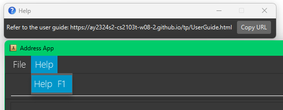
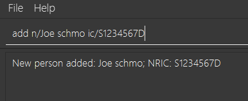
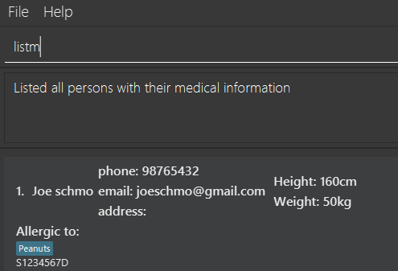
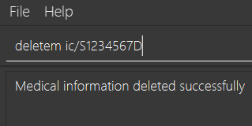
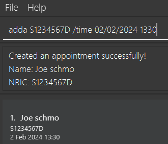
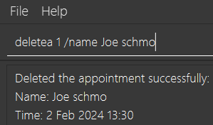
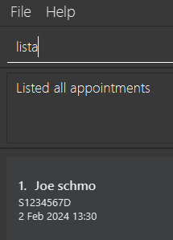
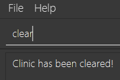

## Introduction

Welcome to **vitalConnect**, your all-in-one desktop application for efficient clinic management, optimized for both Command Line Interface (CLI) and Graphical User Interface (GUI). Designed to streamline your clinic management tasks, VitalConnect offers the speed of a CLI with the convenience of a GUI, allowing you to effortlessly organize your patient and appointments with just a few keystrokes.

If you are relatively good at typing, having the benefit of CLI of reducing time of dragging your mouse around, vitalConnect empowers you to manage your appointments swiftly and effectively. With its intuitive interface and robust features, you can add, delete, and search for appointments, track medical information, as well as check patient contact for communication with ease.

This user guide serves as your comprehensive manual for navigating vitalConnect's features and functionalities. From quick-start instructions to detailed command summaries, you'll find everything you need to maximize your productivity and streamline your management workflow.

So, whether you're a busy professional juggling multiple appointments, vitalConnect is here to simplify your life. Let's dive in and explore how vitalConnect can revolutionize the way you manage your appointment and patient.

--------------------------------------------------------------------------------------------------------------------

## Table of Contents

- [Quick start](#quick-start)
- [Features](#features)
    - [Viewing help](#viewing-help--help)
    - [Adding a patient](#adding-a-patient--add)
    - [Listing all patients](#listing-all-patients--list)
    - [Locating patients by name](#locating-patients-by-name--find)
    - [Deleting a patient](#deleting-a-patient--delete)
    - [Adding contact information](#adding-contact-information--addc)
    - [Listing contact information](#listing-contact-information--listc)
    - [Deleting contact information](#deleting-contact-information--deletec)
    - [Adding medical information](#adding-medical-information--addm)
    - [Listing medical information](#listing-medical-information--listm)
    - [Deleting medical information](#deleting-medical-information--deletem)
    - [Adding an appointment](#adding-an-appointment--adda)
    - [Deleting an appointment](#deleting-an-appointment--deletea)
    - [Listing appointments](#list-out-appointments--lista)
    - [Clearing all entries](#clearing-all-entries--clear)
    - [Exiting the program](#exiting-the-program--exit)
    - [Saving the data](#saving-the-data)
    - [Editing the data file](#editing-the-data-file)
    - [Editing medical information](#editing-the-medical-information--editm)
    - [Archiving data files](#archiving-data-files-coming-in-v20)
- [FAQ](#faq)
- [Known issues](#known-issues)
- [Command summary](#command-summary)

--------------------------------------------------------------------------------------------------------------------

## Quick start

1. Ensure you have Java `11` or above installed in your Computer.

2. Download the latest `vitalconnect.jar` from [here](https://github.com/AY2324S2-CS2103T-W08-2/tp/releases).

3. Copy the file to the folder you want to use as the _home folder_ for your vitalConnect.

4. Open a command terminal, `cd` into the folder you put the jar file in, and use the `java -jar vitalConnect.jar` command to run the application. 
   A GUI similar to the below should appear in a few seconds. Note how the app contains some sample data. 
   

5. Type the command in the command box and press Enter to execute it. e.g. typing **`help`** and pressing Enter will open the help window. 
   Some example commands you can try:

   * `list` : Lists all patients.

   * `add n/John Doe ic/S1234567D` : Adds a patient named `John Doe` with nric `S1234567D` to the Clinic.

   * `delete 3` : Deletes the 3rd patient shown in the current list.

   * `clear` : Deletes all patients.

   * `exit` : Exits the app.

Refer to the [Features](#features) below for details of each command.

[Back to Top](#top)

--------------------------------------------------------------------------------------------------------------------

## Features

**:information_source: Notes about the command format:** 

* Words in `UPPER_CASE` are the parameters to be supplied by the user. 
  e.g. in `add n/NAME ic/NRIC`, `NAME` and `NRIC` are parameters which can be used as `add n/John Doe ic/S1234567D`.

* Items in square brackets are optional. 
  e.g `h/HEIGHT w/WEIGHT [t/ALLERGY]` can be used as `h/163 w/50 t/Amoxicillin` or as `h/163 w/50`.

* Items with `…`​ after them can be used multiple times including zero times. 
  e.g. `[t/ALLERGY]…​` can be used as ` ` (i.e. 0 times), `t/Amoxicillin`, `t/insulin t/iodine` etc.
  e.g. `[t/ALLERGY]…​` can be used as ` ` (i.e. 0 times), `t/Amoxicillin`, `t/insulin t/iodine` etc.

* Parameters can be in any order. 
  e.g. if the command specifies `ic/NRIC p/PHONE_NUMBER`, `p/PHONE_NUMBER ic/NRIC` is also acceptable.

* Extraneous parameters for commands that do not take in parameters (such as `help`, `list`, `exit` and `clear`) will be ignored. 
  e.g. if the command specifies `help 123`, it will be interpreted as `help`.

* If you are using a PDF version of this document, be careful when copying and pasting commands that span multiple lines as space characters surrounding line-breaks may be omitted when copied over to the application.

### Viewing help : `help`

Shows a message explaning how to access the help page.

Format: `help`

[Back to Top](#top)

## Patient Management
### Adding a patient : `add`

Adds a patient to the clinic.

Format: `add n/NAME ic/NRIC`

Examples:
* `add n/John Doe ic/S1234567D`

[Back to Top](#top)

### Listing all patients : `list`

Shows a list of all patients in the clinic.

Format: `list`

[Back to Top](#top)

### Locating patients by name : `find`

Finds patients whose names contain any of the given keywords.

Format: `find KEYWORD [MORE_KEYWORDS]`

* The search is case-insensitive. e.g `hans` will match `Hans`
* The order of the keywords does not matter. e.g. `Hans Bo` will match `Bo Hans`
* Only the name is searched.
* Only full words will be matched e.g. `Han` will not match `Hans`
* Patients matching at least one keyword will be returned (i.e. `OR` search).
  e.g. `Hans Bo` will return `Hans Gruber`, `Bo Yang`

Examples:
* `find John` returns `John Doe` and `John Bard` 
  

[Back to Top](#top)

### Deleting a patient : `delete`

Deletes the specified patient from the clinic.

Format: `delete INDEX`

* Deletes the patient at the specified `INDEX`.
* The index refers to the index number shown in the displayed patient list.
* If the panel is currently not showing any patient list (e.g. showing appointment list), the default patient list is the general clinic patient list (which contains all the patients).
* The index **must be a positive integer** 1, 2, 3, …​

> [!CAUTION]
> The deletion of a patient will result in the deletion of all the contact and medical information as well as all the appointments of the patient.
> If accidentally delete a patient, can use `undo` command to recover the deleted patient.

Examples:
* `list` followed by `delete 2` deletes the 2nd patient in the clinic.
* `find Betsy` followed by `delete 1` deletes the 1st patient in the results of the `find` command.

[Back to Top](#top)

## Contact Management

### Adding contact information : `addc`

Adds contact information to a patient in the clinic.

Format: `addc ic/NRIC [p/PHONE_NUMBER] [e/EMAIL] [a/ADDRESS]`

* At least one of the optional fields must be provided.
* Phone number should be of 3 to 15 digits long.
* Emails should be of the format local-part@domain and adhere to the following constraints:
  1. The local-part should only contain alphanumeric characters and these special characters, excluding the parentheses, (+_.-). The local-part may not start or end with any special characters, and the special characters should not be adjacent to each other.
  2. This is followed by a '@' and then a domain name. The domain name is made up of domain labels separated by periods.
     The domain name must:
      - end with a domain label at least 2 characters long
      - have each domain label start and end with alphanumeric characters
      - have each domain label consist of alphanumeric characters, separated only by hyphens, if any.
* Address has a max length of 50 characters, and it should not be empty upon adding.

Examples:
* `addc ic/S1234567D p/91234567`
* `addc ic/S1234567D e/test@email.com p/91234567`
* `addc ic/S1234567D a/123, Clementi Rd, 1234665 e/test@email.com p/91234567`

[Back to Top](#top)

### Editing contact information : `editc`

Edits contact information of a patient in the clinic. It is also used to add or delete certain field of the contact information.

Format: `editc ic/NRIC [p/PHONE_NUMBER] [e/EMAIL] [a/ADDRESS]`

* We call `[p/PHONE_NUMBER]`, `[e/EMAIL]`, and `[a/ADDRESS]` as the `optional fields`. It has a structure of `prefix/VALUE`.
* At least one of the `optional fields` must be provided.
* To delete an `optional field`, leave the `VALUE` part empty.
* If the `VALUE` part is not empty, the corresponding patient contact's field will either be updated or added with the new value.
* If all three fields of contact information (phone, email, and address) become empty, the contact information of the patient will be considered deleted. If one want to add a new contact information, please use `addc` command.

Examples:
* `editc ic/S1234567D p/91234567` will result in the phone number of the patient with NRIC `S1234567D` being updated to `91234567`.
* `editc ic/S1234567D a/` will result in the address of the patient with NRIC `S1234567D` being deleted.
* Suppose the person currently has a phone number only, `editc ic/S1234567D e/email@test.com` will result in the email of the patient with NRIC `S1234567D` being updated to `email@test.com`.
* `editc ic/S1234567D p/ e/ a/` will have same effect as `deletec ic/S1234567D`, resulting in the contact information of the patient with NRIC `S1234567D` being deleted.

[Back to Top](#top)

### Listing contact information : `listc`

Lists all patients with non-empty contact information.

[Back to Top](#top)

### Deleting contact information : `deletec`

Deletes contact information from a patient in the clinic.

Format: `deletec ic/NRIC`

Examples:
* `deletec ic/S1234567D` will result in the contact information of the patient with NRIC `S1234567D` being deleted.

[Back to Top](#top)

## Medical Information Management

### Adding medical information : `addm`

Adds medical information to a patient in the clinic.

Format: `addm ic/NRIC h/HEIGHT w/WEIGHT [t/ALLERGY]…​`

Examples:
* `addm ic/S1234567D h/163 w/50`
* `addm ic/S1234567D h/163 w/50 t/insulin t/iodine`

[Back to Top](#top)

### Editing the medical information : "editm"

Edit the medical information of an existing person.

Format: `editm ic/NRIC [h/HEIGHT] [w/WEIGHT] [-o] [at/ALLERGY…​]`

* At least one of the optional fields must be provided.
* The overwrite notation `-o` should only appear once.
* `-o` can be placed at any position in the command.

Prefix explanation:
- `w/WEIGHT`, `h/HIGHT`: Change the current wight and height value to WEIGHT and HEIGHT.
- `at/ALLERGY`: Append this tag to existing tag.
- `-o`: Set mode for this command to overwrite, meaning all existing tag will be deleted and replaced by the new tags.

Example:
* `editm ic/S1234567D w/100 -o at/milk at/egg`

This will change the weight of person with ic S1234567D to 100 and
overwrite allergy tag to milk and egg.
* Noted that command achieving same effect could be `editm ic/S1234567D w/100 at/milk at/egg -o` or `editm ic/S1234567D -o w/100 at/milk at/egg`.

> [!CAUTION]
> Use of prefix `-o` will delete all existing tag, including the added tag in current command before it.
> Please use with cautious.

[Back to Top](#top)

### Listing medical information : `listm`

Lists all patients with medical information.

[Back to Top](#top)

### Deleting medical information : `deletem`

Deletes medical information from a patient in the clinic.

Format: `deletem ic/NRIC`

Examples:
* `deletem ic/S1234567D` will result in the medical information of the patient with NRIC `S1234567D` being deleted.

[Back to Top](#top)

## Appointment Management

### Adding an appointment : `adda`

Adds an appointment for an exist patient to the appointment list.

Format: `adda ic/NRIC s/START TIME d/DURATION`

* The patient(ic) should already exist in the patient list.
* The start time should be in the format: DD/MM/YYYY HHmm.
* The start time should not be earlier than now time.
* The time length of one unit of duration equals 15 minutes.
* The input for duration should be larger than 0.

Examples:
* `adda ic/S1234567D s/ 02/02/2024 1300 d/2` 
* will add an appointment for the patient with NRIC `S1234567D` start from 2nd February 2024 at 1:00 PM and end at 1:30 PM.

[Back to Top](#top)

### Editing an appointment : `edita`

Edits the start time and duration of an appointment of an existing person.

Format: `edita INDEX s/START TIME d/DURATION`

* The index should not be out of range nor negative.
* The start time should be in the format: DD/MM/YYYY HHmm.
* The start time should not be earlier than now time.
* The time length of one unit of duration equals 15 minutes.
* The input for duration should be larger than 0.
* The edited appointment should not overlap with other appointments.

[Back to Top](#top)

### Deleting an appointment : `deletea`

Delete an exist appointment from the appointment list by providing the index of the appointment
in the list.

Format: `deletea INDEX`

* The index should not be out of range nor negative.

Examples:
* `deletea 1`

[Back to Top](#top)

### List out appointments : `lista`

List out all the appointments in the appointment list.

Format: `lista`

[Back to Top](#top)

## Other Features

### Undoing the previous command : `undo`

Undoes the previous command that changes the data.

Format: `undo`

### Clearing all entries : `clear`

Clears all entries from the clinic.

Format: `clear`

> [!CAUTION]
> This command will delete all the patients from the clinic. Please use with cautious.

[Back to Top](#top)

### Exiting the program : `exit`

Exits the program.

Format: `exit`

[Back to Top](#top)

### Saving the data

Clinic data are saved in the hard disk automatically after any command that changes the data. There is no need to save manually.

[Back to Top](#top)

### Editing the data file

Clinic data are saved automatically as a JSON file `[JAR file location]/data/clinic.json`. Advanced users are welcome to update data directly by editing that data file.

:exclamation: **Caution:**
If your changes to the data file makes its format invalid, Clinic will discard all data and start with an empty data file at the next run. Hence, it is recommended to take a backup of the file before editing it. 
Furthermore, certain edits can cause the Clinic to behave in unexpected ways (e.g., if a value entered is outside of the acceptable range). Therefore, edit the data file only if you are confident that you can update it correctly.

### Archiving data files `[coming in v2.0]`
_Details coming soon ..._

--------------------------------------------------------------------------------------------------------------------

## FAQ

**Q**: How do I transfer my data to another Computer? 
**A**: Install the app in the other computer and overwrite the empty data file it creates with the file that contains the data of your previous Clinic home folder.

--------------------------------------------------------------------------------------------------------------------

## Known issues

1. **When using multiple screens**, if you move the application to a secondary screen, and later switch to using only the primary screen, the GUI will open off-screen. The remedy is to delete the `preferences.json` file created by the application before running the application again.

--------------------------------------------------------------------------------------------------------------------

## Command summary
| Action      | Format, Examples                                                                                                                        |
|-------------|-----------------------------------------------------------------------------------------------------------------------------------------|
| **Add**     | `add n/NAME ic/NRIC`   e.g., `add n/John Doe ic/S1234567D`                                                                           |
| **Clear**   | `clear`                                                                                                                                 |
| **Delete**  | `delete INDEX`  e.g., `delete 3`                                                                                                     |
| **Find**    | `find KEYWORD [MORE_KEYWORDS]`  e.g., `find James Jake`                                                                              |
| **List**    | `list`                                                                                                                                  |
| **Addc**    | `addc ic/NRIC [p/PHONE_NUMBER] [e/EMAIL] [a/ADDRESS]` e.g., `addc ic/S1234567D a/123, Clementi Rd, 1234665 e/test@email.com p/91234567` |
| **Editc**   | `editc ic/NRIC [p/PHONE_NUMBER] [e/EMAIL] [a/ADDRESS]` e.g., `editc ic/S1234567D a/ e/test@email.com p/91234567`                        |
| **Listc**   | `listc`                                                                                                                                 |
| **Deletec** | `deletec ic/NRIC` e.g., `deletec ic/S1234567D`                                                                                          |
| **Addm**    | `addm ic/NRIC h/HEIGHT w/WEIGHT [t/ALLERGY]…​` e.g., `addm ic/S1234567D h/163 w/50 t/insulin t/iodine`                                  |
| **Listm**   | `listm`                                                                                                                                 |
| **Deletem** | `deletem ic/NRIC` e.g., `deletec ic/S1234567D`                                                                                          |
| **Adda**    | `adda NRIC s/DD/MM/YYYY HHMM d/DURATION` e.g., `adda S1234567D s/ 02/02/2024 1300 d/2`                                                  |
| **Edita**   | `edita INDEX [s/DD/MM/YYYY HHMM] [d/DURATION]` e.g., `edita 1 s/ 02/02/2024 1300 d/4`                                                   |
| **Lista**   | `lista`                                                                                                                                 |
| **Deletea** | `deletea INDEX` e.g., `deletea 1`                                                                                                       |
| **Help**    | `help`                                                                                                                                  |

[Back to Top](#top)
